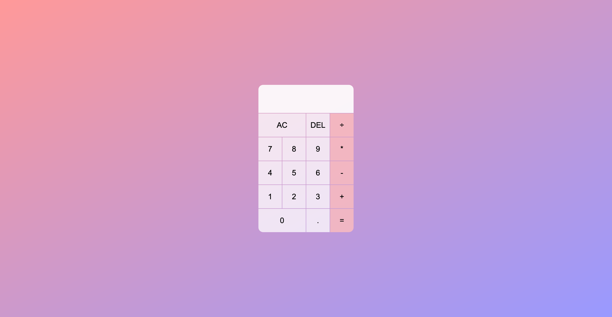

# Calculator

## Table of contents

-   [Overview](#overview)
    -   [Screenshot](#screenshot)
    -   [Links](#links)
-   [My process](#my-process)
    -   [Built with](#built-with)
    -   [What I learned](#what-i-learned)
    -   [Continued development](#continued-development)
-   [Author](#author)

## Overview

### Screenshot



<!--  -->

### Links

-   Live Site URL: [See the example from my site](https://michaelho02.github.io/Calculator/)

## My process

### Built with

-   Semantic HTML5 markup
-   CSS custom properties
-   Grid
-   Javascript

### What I learned

Through this project, I learn to use the `grid` to get all the button align in 4 rows and 4 columns. I also learn to make certain item such as `AC` or `0` buttons to be `2 column span`.

My main learning from this project is from the implementation of the `Javascript` into web-promgramming. I have create a class call `Calculator` in which will have the following public method:

-   `clear()` which will be activated by clicking `AC` button
-   `delete()` which will be activated by clicking `DEL` button
-   `appandNumber()` which will be activated by clicking numerical button
-   `chooseOperation()` which will be activated by clicking operation button
-   `compute()` will calculate the previous number and the current number base on the operand
-   `updateDisplay()` will show the result

Furthermore, I also understanding the usage of the `querySelectorAll()` and `querySelector()` where I will try to select the attribute from the tag. I can create my own tag base on the naming convention in HTML5 `data-attribute_name`. I design so that the button from 0-9 will have the attribute `data-number`, operand will have `data-operation`, equal button will have `data-equal`, delete button will have `data-delete`, all clear (AC) button will have `data-all-clear`. Furthermore to modify or read the text that wrap around the tag, I also use the function `innerText` which will allows me to modify or read the text between wrap tag. Thus, I can read the number and the operator and further calculate the value base on that. Finally, after I have the result, I can display it by modify the tag in the `ouput` class via `innerText`.

```js
updateDisplay() {
    this.currentOperationTextElement.innerText = this.getDisplayNumber(
        this.currentOperand
    );
    if (this.operation != null) {
        this.previousOperationTextElement.innerText = `${this.getDisplayNumber(
            this.previousOperand
        )} ${this.operation}`;
    } else {
        this.previousOperationTextElement.innerText = '';
    }
}
```

Lastly, I learn to use the lamda function in Javascript by setting the event listener for all the button. For example, I add the event listtener for the delete button and the list of number from 0-9.

```js
deleteButton.addEventListener("click", () => {
	calculator.delete();
	calculator.updateDisplay();
});

numberButtons.forEach((button) => {
	button.addEventListener("click", () => {
		calculator.appendNumber(button.innerText);
		calculator.updateDisplay();
	});
});
```

### Continued development

I want to improve my understanding on the usesage of the `grid` and `javascript` by applying it on complicated project so that I have a deep understanding of interating between javascript and the html.

## Author

-   Website - [Ho Le Minh Thach (Michael Ho)](https://github.com/MichaelHo02)
-   Frontend Mentor - [@MichaelHo02](https://www.frontendmentor.io/profile/MichaelHo02)
